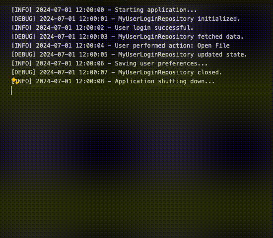

# Delete Lines with Selected Text VSCode Extension

This extension allows you to delete all lines containing the selected text in the current editor. This is primarily useful for analyzing log files that may contain a lot of repeated instances of unhelpful or "noisy" text. Deleting all lines containing a specific error message or other text can help you focus on the important parts of the log.

## Features

- Delete lines containing specific text from the current editor

## Usage

1. Open any text file.
2. Select some text.
3. Right-click and choose "Delete Lines with Selected Text".

## Example

## Building
To build this extension, run `npm install` and then `npm run package`.

## Installing
Within VSCode, go to Extensions --> click on the 3 dots in the top right --> Install from VSIX, and select the .vsix file.

## Contributing

Feel free to open issues or submit pull requests if you have suggestions for improvements or find any bugs.

## License

MIT License